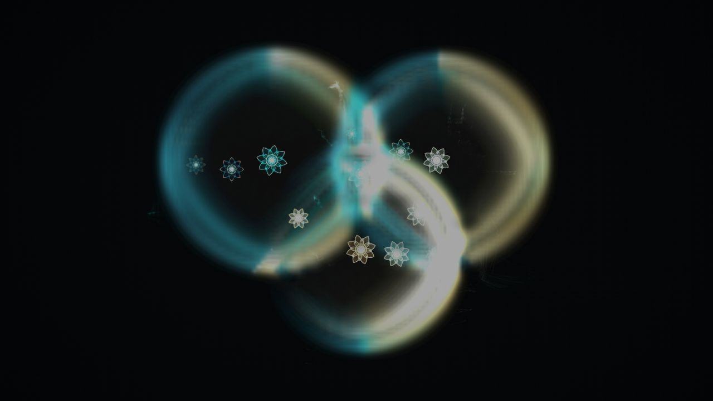

# Qart：量子ウォークが描く波動模様

[](https://github.com/Reimangod/Qart-Leona/actions/workflows/ci.yml)

**人がタネを置き、計算の中の波が風景を育てる。**

Qartは、量子ウォークの振幅と位相を、青緑と金の光景へつなぐインタラクティブ・ジェネラティブアートです。触れた場所から波が広がり、別の波と重なり、干渉の続いた場所に花が生まれます。



*現行の161×161格子版をブラウザーで実行した画面。波と花は、その場の計算から描かれます。*

[作品について](docs/concept.md) · [画面を見る](docs/gallery.md) · [起動する](#起動) · [数理と実装](docs/algorithm.md) · [展示・運用](docs/exhibition.md)

## 体験

タイトルに触れると、タネのない暗い画面へ移ります。次のタップで好きな場所にタネを置き、広がる波を眺めます。指を動かすと、その軌跡が位相へ働きかけ、後の干渉模様が変化します。

複数のタネは同じ場の中で干渉します。それぞれの波は置かれてから100ステップを超えると徐々に薄くなり、180ステップで消えます。画面には作品を全画面で表示し、進行は自動です。

## 起動

Node.js **22.12以降**と、**WebGL 2**に対応したブラウザーを使用します。リポジトリへのアクセス権がある環境で実行してください。

```sh
git clone https://github.com/Reimangod/Qart-Leona.git
cd Qart-Leona
npm ci
npm run dev
```

[localhost:5174](http://localhost:5174/) を開きます。音はタイトルを閉じた後、最初の作品操作で始まります。

| 操作 | 作品への働きかけ |
| --- | --- |
| クリック／タップ | タネを置く |
| ドラッグ | 位置ごとの位相を変える |
| 長押し | 確率に沿って位置を選び、その近傍から再開する |
| `F` / `M` | 全画面 / 音の切り替え |
| `R` / `S` | リセット / PNG画像の保存 |

## 波をつくる規則

各格子点には二つの複素振幅があります。「混ぜる → 横へ移動する → 位相を変える → 混ぜる → 縦へ移動する」という一連の操作を繰り返します。

```math
|\Psi(t+1)\rangle = S_y C_y \Phi_t S_x C_x |\Psi(t)\rangle
```

| 計算から取り出すもの | 見えるもの |
| --- | --- |
| 位置ごとの確率 | 波の明るさの基礎 |
| 二つの振幅の相対位相 | 青緑・白・金の色彩 |
| 干渉の強さと持続 | 花の発生位置 |
| 近隣の複素振幅の関係 | 細い流線 |
| 波の年齢と過去の描画 | フェードと残光 |

確率・位相から光景への変換には、露光、発光、花弁などの造形規則を加えています。数理モデルと描画処理の対応、独立フェードの扱いは[数理と実装](docs/algorithm.md)に記載しています。

## 実行構成

**量子ウォークの計算はCPU、描画はWebGL 2を使うGPU、音はWeb Audio API**で処理します。現在の版は、量子ウォークを古典計算機上で扱うリアルタイムシミュレーションです。

- 格子：161×161、各地点に二つの複素振幅（合計51,842個）
- 保存形式：32ビット浮動小数点の実部・虚部
- 更新：1量子ステップあたり185 ms、描画は最大60 fpsを目標
- 通信：起動後の計算・描画・音はブラウザー内で完結

必要メモリ、表示解像度の影響、長時間運用時の確認項目は[展示・運用](docs/exhibition.md)を参照してください。

## 開発と検証

```sh
npm run check
```

数理・操作・資料のテスト、TypeScriptの型検査、本番ビルドを順に実行します。GitHub Actionsでも同じ検証を実施します。

```text
src/main.ts          状態更新、操作、造形データ、音響
src/renderer.ts      WebGL 2の発光・流線・花・残光
src/style.css        全画面表示とオープニング
tests/               数理・操作・資料の自動テスト
docs/                コンセプト、数理、展示案内、実画面
.github/workflows/   GitHub上の品質チェック
```

[変更の方針](CONTRIBUTING.md) · [更新履歴](CHANGELOG.md) · [権利表記](NOTICE.md)
