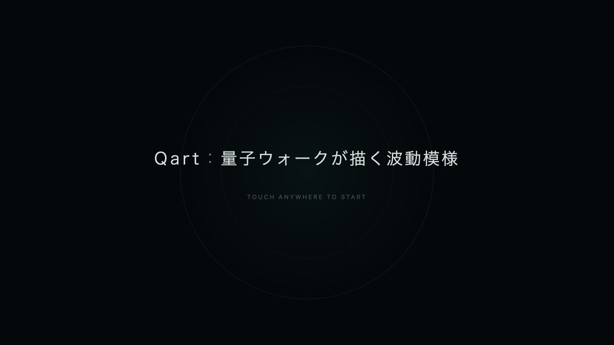

# 画面記録

[READMEへ戻る](../README.md)

以下は、作品本体のコミット`2a85751`をローカルのブラウザーで実行したスクリーンショットです。紹介用の合成画像ではなく、実際の画面を記録しています。撮影時の表示領域は1280×720です。

## 波と花

三つのタネを置いた後の画面です。波が互いに重なり、干渉の履歴をもとに花が生まれています。波の計算と花の位置選択には規則を用い、細い流線の初期配置などには乱数を用います。そのため、画面全体は実行ごとに細部が変わります。

## オープニング

タイトルに触れるとフェードアウトし、タネのない作品画面へ移ります。次のタップから、鑑賞者自身が最初の位置を選べます。
